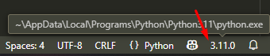

# University Requirements

All the rules must be followed on all assignments to avoid any unnecesary reduction on the amount of points.

## Assignment Submission Rules

* **No Copying**: Solutions may not be copied from the lecture notes, the internet, or other sources. These sources may only be used with proper **citations**, and your own contribution must be clearly significant in the submitted solutions.

* **File Formats**: Digital submissions that are not in `.pdf` or `.txt` format for text, or `.py` for code, will not be graded. If multiple files are submitted, they must be bundled together in a `.zip` archive.

* **Author Variable**: Make sure to correctly set the `__author__` variable in all source code files (`.py`) at the beginning of the code:

  ```python
  __author__ = "<Matriculation-No>, <LastName>"
  # Rest of the code...
  ```

  Example: `__author__ = "1234567, Noceda"`

  **Important**: Note the spaces before and after the `=` and the space after the comma. Do **not use angle brackets**; those are just used here to show variable placeholders.

* **Name in Documents**: Your name must appear in every submitted `.pdf` and `.txt` file.
  
  ```
  <LastName>_<Name>_<ClassName>_<BlattNumber>
  ```
  Example: `Noceda_Luz_EPR_00`


# Setup Guide
## 1. Install Visual Studio Code (VS Code)


###  **For Windows:**
1. Go to the [VS Code download page](https://code.visualstudio.com/)
2. Click **"Download for Windows"**
3. Run the downloaded installer (usually named `VSCodeSetup.exe`)
4. Follow the setup wizard:

   * ✔ Check the box "Add to PATH" (important for terminal access)
   * ✔ Check "Register Code as an editor for supported file types"
5. Finish the installation and open **VS Code**


###  **For macOS:**
1. Visit the [VS Code download page](https://code.visualstudio.com/)
2. Click **"Download for macOS"**
3. Open the `.zip` file and drag **Visual Studio Code** into the `Applications` folder
4. (Optional) Open a terminal and run:

   ```bash
   sudo ln -s /Applications/Visual\ Studio\ Code.app/Contents/Resources/app/bin/code /usr/local/bin/code
   ```

   > This allows you to open VS Code from terminal with the `code` command.


## 2. Install Python 🐍

Download the newest Python version or the version recommended by the Professor

###  **For Windows:**

1. Go to the [Python download page](https://www.python.org/downloads/windows/)
2. Download the latest **Python 3.x** version (e.g., `Python 3.13`)
3. Run the installer:

   * ✔ Important: **Check the box "Add Python to PATH"**
   * Choose "Install Now" (recommended)
4. Verify installation:

   * Open Command Prompt (CMD) and type:

     ```bash
     python --version
     ```
   * You should see something like `Python 3.x.x`

###  **For macOS:**

1. Go to the [Python download page](https://www.python.org/downloads/mac-osx/)
2. Download the latest macOS installer (e.g., `python-3.13.x-macosx.pkg`)
3. Run the installer and follow the instructions
4. Verify installation:

   * Open Terminal and type:

     ```bash
     python3 --version
     ```

   > Note: macOS uses `python3` instead of `python`


## 3. Install Python Extension for VS Code

1. Open **VS Code**
2. Click the **Extensions icon** on the left sidebar (or press `Ctrl+Shift+X` / `Cmd+Shift+X`)
3. Search for **"Python"**
4. Install the extension published by **Microsoft**

   * This adds syntax highlighting, IntelliSense, debugging, and more


## 4. Configure VS Code for Python Development

#### Set Python Interpreter:

1. Open any `.py` file or create a new one
2. Click on the **Python interpreter** shown at the bottom-left corner (or bottom-right)
   
   

3. Select the installed version of Python (e.g., `Python 3.12.x`)

   * If nothing shows, click "Enter Interpreter Path" and locate it manually:

     * Windows default: `C:\Users\<YourName>\AppData\Local\Programs\Python\Python3x\python.exe`
     * macOS: usually `/usr/local/bin/python3`


## 5. Set 100-Character Line Length Rule in VS Code

### Option 1: Through VS Code GUI Settings

1. Open settings:

   * `Ctrl + ,` (Windows/Linux)
   * `Cmd + ,` (macOS)

2. In the search bar, type:

   ```
   word wrap column
   ```

3. Set `Editor: Word Wrap Column` to `100`

4. Enable word wrap:
   Search for `word wrap`
   Set `Editor: Word Wrap` to `wordWrapColumn`

5. Add a visual ruler:

   * Search for `rulers`
   * Click **"Edit in settings.json"**
   * Add the following line:

     ```json
     "editor.rulers": [100]
     ```

---

### Option 2: Edit `settings.json` Directly

1. Press `Ctrl + Shift + P` (or `Cmd + Shift + P` on macOS)
2. Type: `Open Settings (JSON)` and select it
3. Add the following lines:

   ```json
   {
     "editor.wordWrapColumn": 100,
     "editor.wordWrap": "wordWrapColumn",
     "editor.rulers": [100],
     "files.trimTrailingWhitespace": true,
     "editor.formatOnSave": true
   }
   ```

   > 💡 These extras (`trimTrailingWhitespace` and `formatOnSave`) help keep code clean but are **completly** optional


## 6. Test Your Setup

1. Create a new Python file: `test.py`

2. Add:

   ```python
   __author__ = "1234567, Noceda" # Your __autho__ variable

   print("Hello, world! This line is under 100 characters.")
   ```

3. Right-click and choose **"Run Python File in Terminal"**
   You should see the output:

   ```
   Hello, world! This line is under 100 characters.
   ```
---

If you have any problem feel free to ask for help

# Where to find information about coding, specifics of Python and so on?
1. [W3 Schools - For concepts and examples](https://www.w3schools.com/python/default.asp)
2. [Python Documentation - For more deep and technical explanations](https://docs.python.org/3/)
3. [Tutorium Discord Group - For Study groups](https://discord.gg/8eZT66HbRB)

There are multiple, blogs, websites, YouTube channels that talk about this topic. Let ChatGPT be the last option.
At the end of the day you still need to learn programming